# 🛍️ SwiftStore
 
**Full-Stack Multi-Vendor Marketplace & Delivery Management Platform**
 
**Stack:** 
-`Python`
-`Flask`
-`SQLAlchemy`
-`SQLite` 
-`HTML5`
-`CSS3`
-`JavaScript`
-`Bcrypt`
-`Flask-Mail`

 
*A complete marketplace connecting Customers, Vendors, and Delivery Agents in one unified platform*
 
---
 
## 📽️ Demo Video
 
> Click below to watch the full demo of SwiftStore in action:
 
▶ [Watch Full Demo on Google Drive](https://drive.google.com/file/d/1YmHnPctyQWPD48DGeTNIy9DNclPL9i1d/view?usp=sharing)
 
---

## 📸 Screenshots

### 🏠 Landing Page — Portal Selection

> Users choose their role to access the appropriate dashboard.

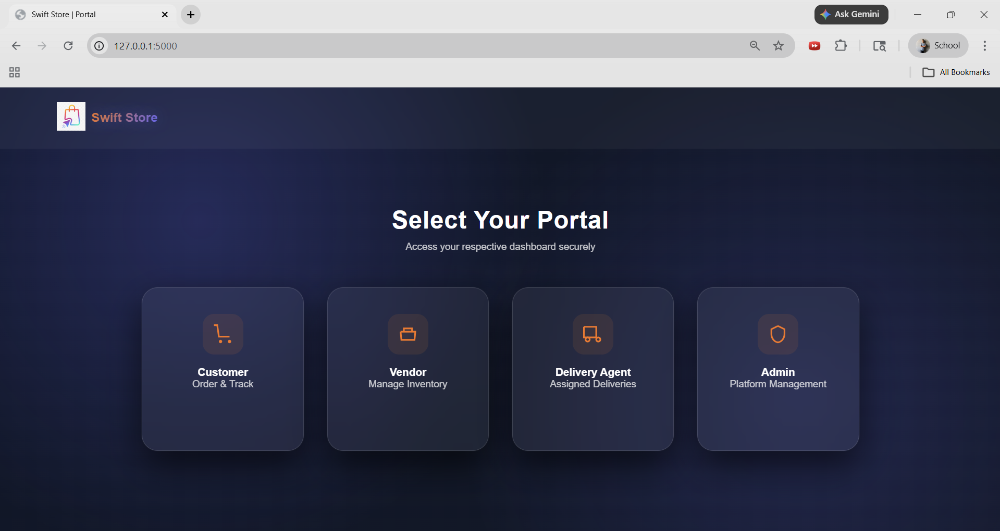

---

### 🛒 Customer Dashboard

**Browse & Search Products**

> Customers can browse all available products from multiple vendors, filter by store, search by name or category, and sort by price or distance.

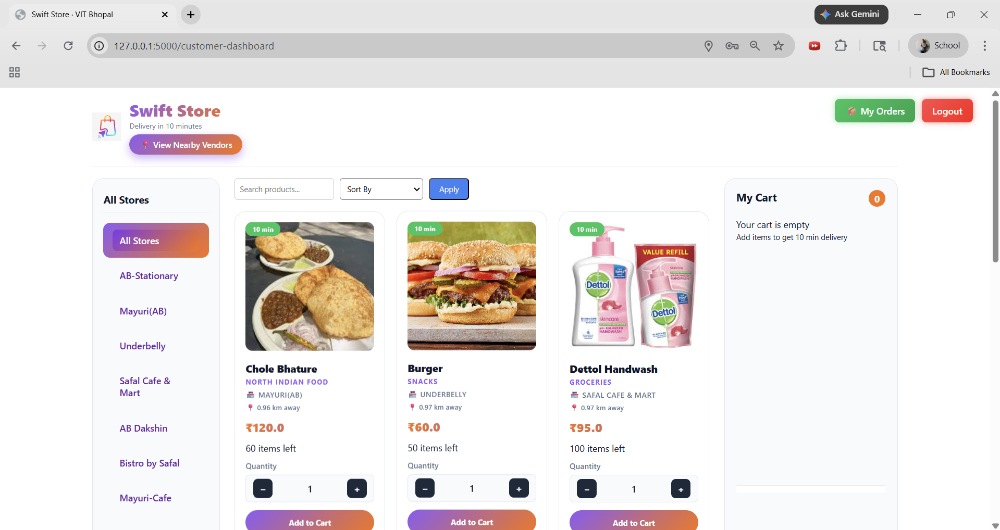

**Search by Category (e.g. "North Indian")**

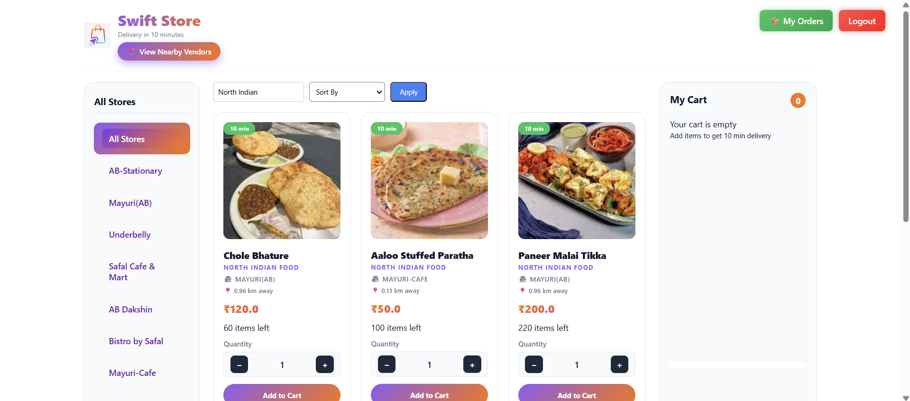

**Search by Item Name (e.g. "Idli")**

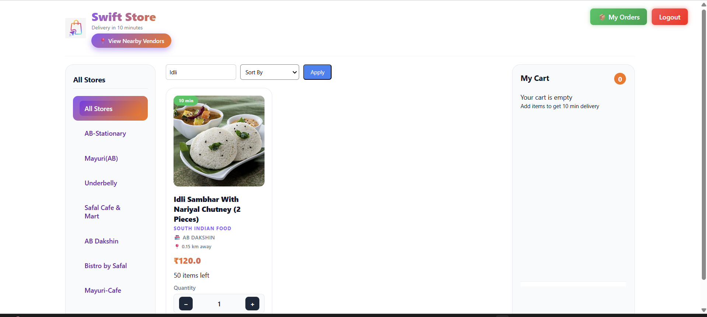

**Cart & Checkout**

> Add items from multiple vendors to a single cart. Choose between Cash on Delivery or Pay Online (UPI). The cart shows a live breakdown of items, delivery fee, and platform fee.

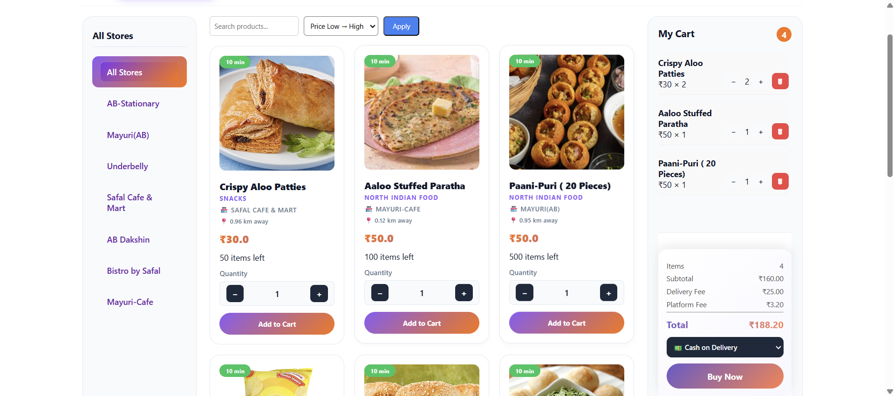

---

### 📍 Nearby Vendors Map

> Customers can view all nearby vendors with their distance and interactive OpenStreetMap previews.

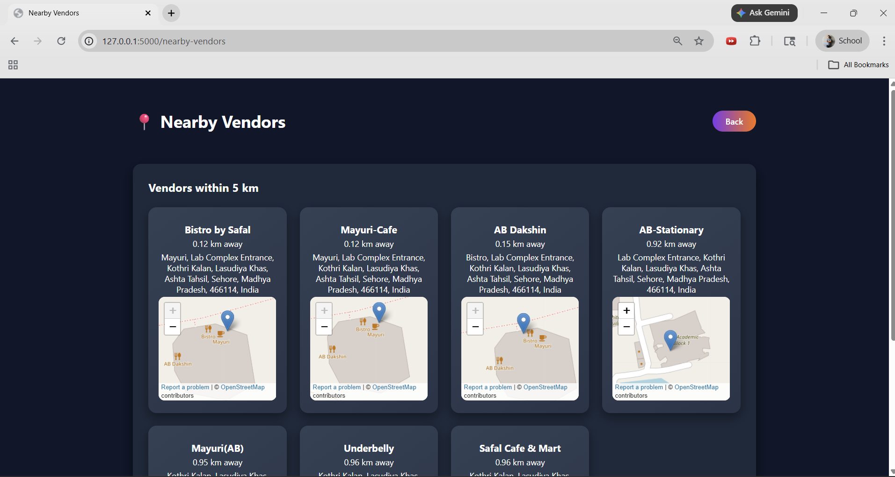

---

### 📧 Email Notifications

SwiftStore sends automated emails at every stage of the order lifecycle:

| Stage | Email |
|-------|-------|
| Order Placed | Vendors are reviewing your order |
| All Vendors Approved | Delivery partner assigned |
| Delivery OTP | Share OTP with delivery agent |
| Order Delivered | Thank you confirmation |
| Complaint Response | Admin reply to your complaint |

**Order Placed Successfully**


**Order Being Prepared (All Vendors Approved)**

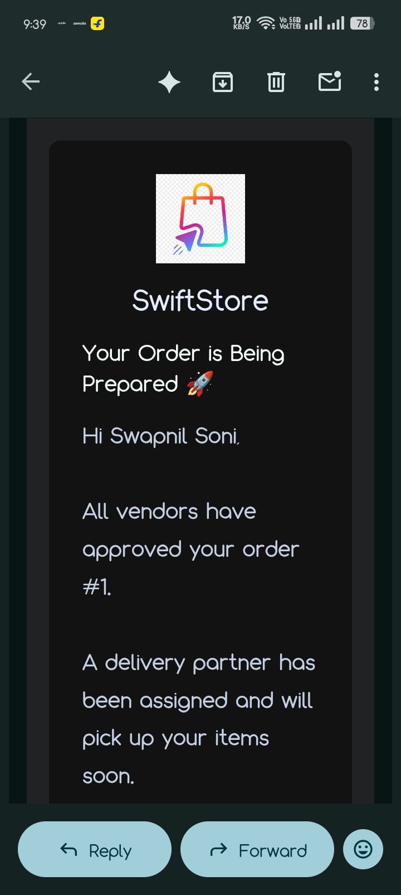

**Delivery OTP**

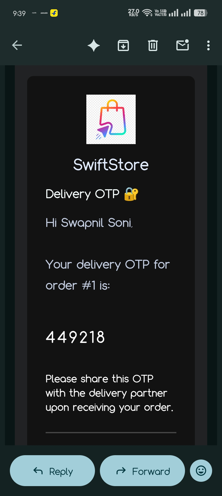

**Order Delivered**

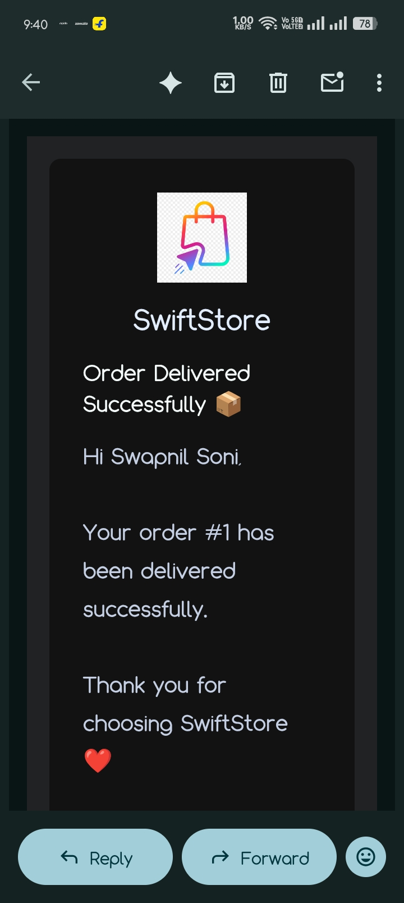

**Complaint Response from Admin**

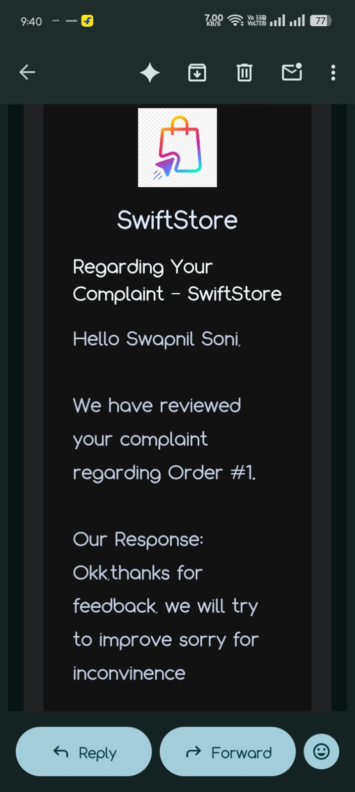

---

### 🏪 Vendor Dashboard

**Performance Insights & Shop Location**

> Vendors can set their shop location via GPS, track performance metrics (top-selling product, success rate, rejection rate), and manage their product inventory.

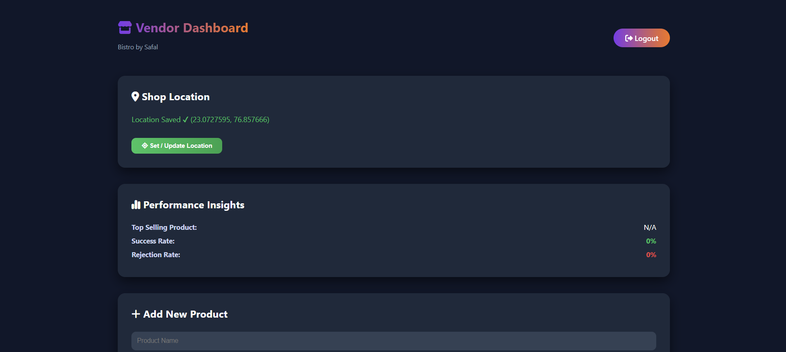

**Product Management**

> Vendors can add, update stock, and remove products. Each product shows category, current stock, and update controls.

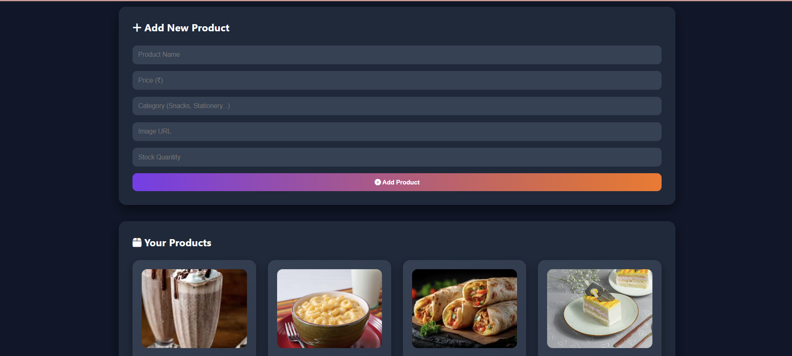

**Earnings Summary**

> Shows gross revenue, platform commission (5%), and net earnings, along with incoming orders.

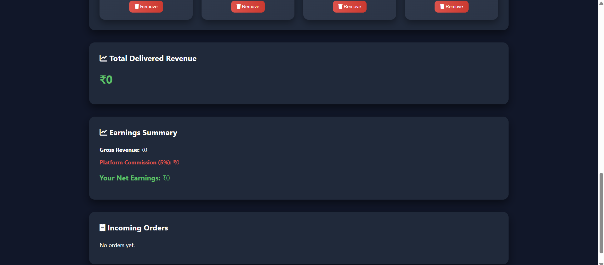

---

### 🛡️ Admin Dashboard

**Overview**

> The admin has a bird's-eye view of total users, orders, and revenue with a daily revenue analytics chart.

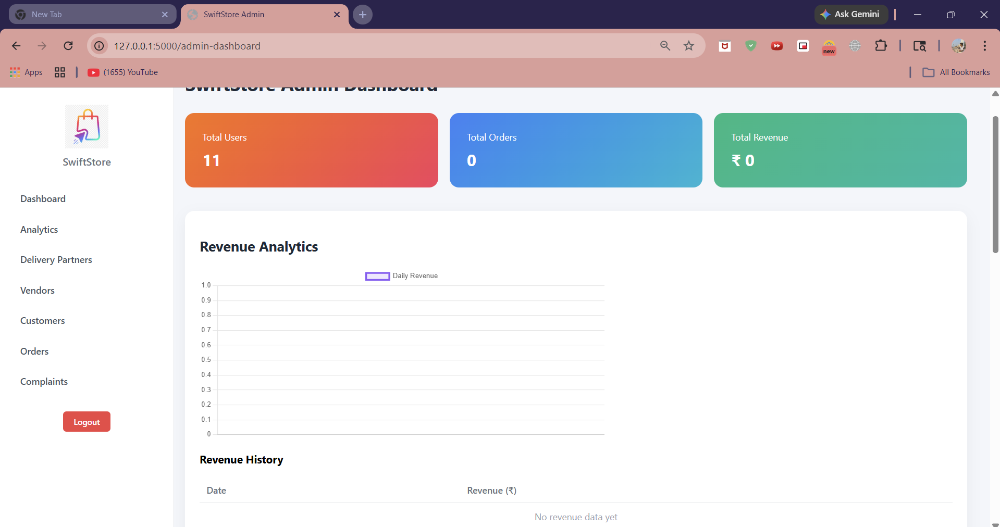

**Vendor Management**

> Admin can view all registered vendors, their pending settlement amounts, and trigger payment settlements.

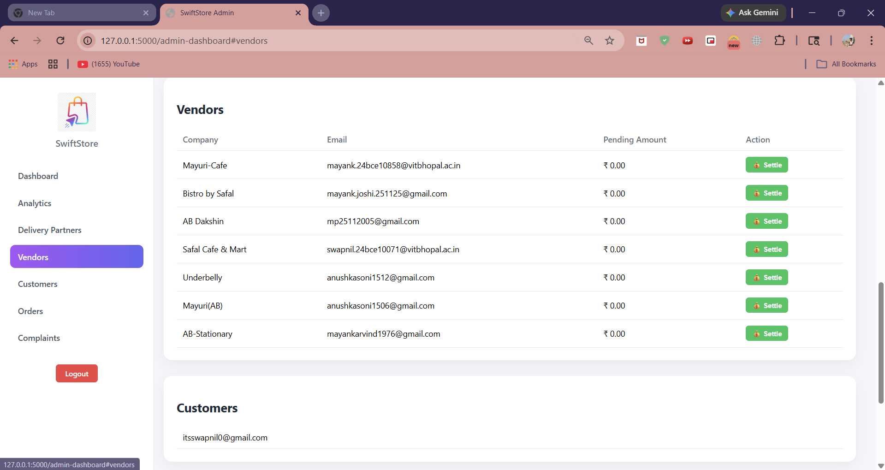

**Delivery Partner Verification**

> Admin reviews delivery partner registrations and can preview their submitted National ID / Driving Licence before approving them.

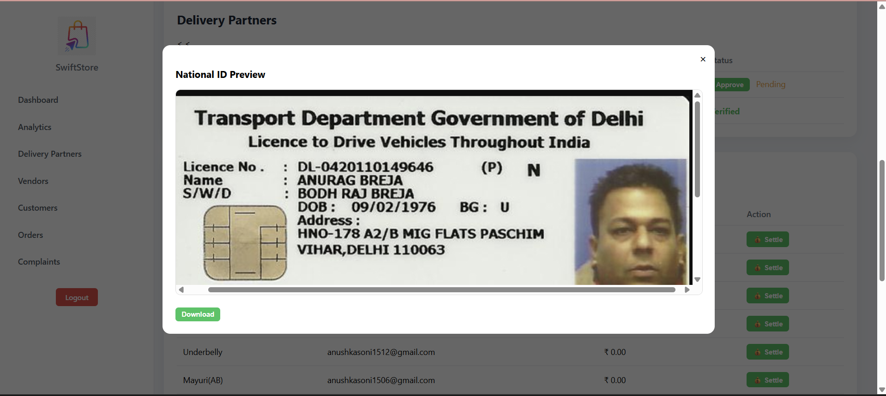

**Complaints Management**

> Admin can view all customer complaints, respond to them, and the response is automatically emailed to the customer.

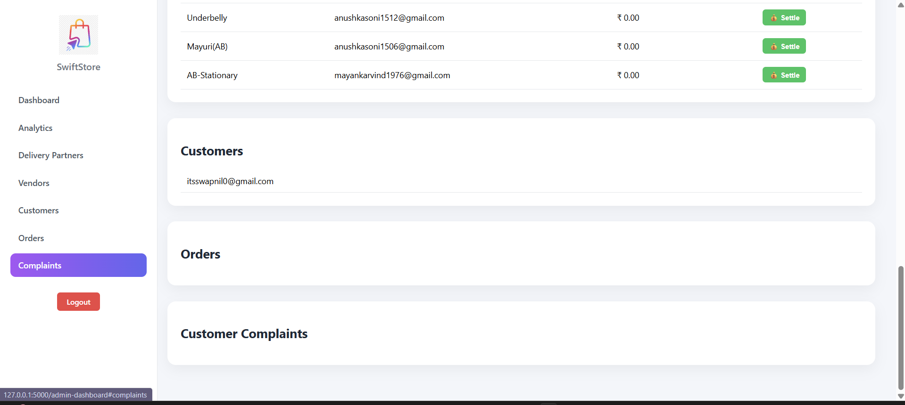

---

## ✨ Features

### 👤 Customer
- Register, login, and manage account
- Browse products from all vendors with search, filter, and sort
- View nearby vendors with distance and map preview
- Add items from multiple vendors into a single cart
- Place orders (Cash on Delivery / Pay Online via UPI)
- Track order status in real-time
- Raise complaints against orders

### 🏪 Vendor
- Register with company details and set shop location (GPS)
- Add, update stock, and remove products with images and categories
- Accept or reject incoming customer orders
- View earnings: gross revenue, 5% platform commission, net earnings
- Track performance: top product, success rate, rejection rate

### 🚚 Delivery Agent
- Register and upload National ID for admin verification
- View and accept available delivery requests
- Update delivery status dynamically
- Confirm delivery using customer OTP

### 🛡️ Admin
- Platform-wide dashboard: total users, orders, revenue
- Revenue analytics chart with daily revenue history
- Manage and approve/reject delivery partner registrations
- Preview uploaded National IDs / Driving Licences
- Manage vendor list and settle pending payments
- View and respond to customer complaints (response is emailed automatically)

---

## 🔒 Security

- **Session-based Authentication** — Secure login sessions per user role
- **Bcrypt Password Hashing** — All passwords are hashed before storage
- **Role-Based Access Control** — Each portal (Customer / Vendor / Delivery / Admin) is strictly isolated
- **OTP Delivery Verification** — A unique OTP is sent to the customer's email and must be provided to the delivery agent to confirm delivery

---

## 🏗️ System Workflow

```
Customer places order
        ↓
Vendors review & approve/reject items
        ↓
All vendors approve → Delivery partner assigned
        ↓
Customer receives Delivery OTP via email
        ↓
Delivery agent picks up & delivers order
        ↓
Customer shares OTP → Delivery confirmed
        ↓
Customer receives delivery confirmation email
```

---

## 🛠️ Tech Stack

| Layer | Technology |
|-------|-----------|
| Backend | Python, Flask, SQLAlchemy |
| Database | SQLite |
| Frontend | HTML5, CSS3, JavaScript |
| Maps | Leaflet.js + OpenStreetMap |
| Email | Flask-Mail (SMTP) |
| Auth | Flask Sessions + Bcrypt |
| Payments | UPI / Cash on Delivery |

---

## 🚀 Getting Started

### Prerequisites

- Python 3.x
- pip

### Installation

```bash
# 1. Clone the repository
git clone https://github.com/Swapnil-code-maker/Swiftstore.git
cd Swiftstore

# 2. Install dependencies
pip install flask flask-sqlalchemy flask-bcrypt flask-mail

# 3. Run the application
python app.py
```

### Access the App

Open your browser and navigate to:
```
http://127.0.0.1:5000
```

Select your portal — **Customer**, **Vendor**, **Delivery Agent**, or **Admin**.

---

## 📁 Project Structure

```
Swiftstore/
├── app.py                  # Main Flask application & all routes
├── services/               # Business logic & helper services
├── static/                 # CSS, JS, images, logo
├── templates/              # Jinja2 HTML templates
│   ├── customer/
│   ├── vendor/
│   ├── delivery/
│   └── admin/
├── screenshots/            # UI screenshots used in README
│   ├── landing.png
│   ├── customer_browse.png
│   ├── cart_checkout.png
│   ├── nearby_vendors.png
│   ├── vendor_dashboard.png
│   ├── admin_dashboard.png
│   └── ...
├── project_report.pdf      # Detailed project report
├── .gitignore
└── README.md

---

## 📄 License

This project is open source and available under the [MIT License](LICENSE).

---

Built with ❤️ using Flask & Python

[▶ Watch Demo](https://drive.google.com/file/d/1YmHnPctyQWPD48DGeTNIy9DNclPL9i1d/view?usp=sharing) · [Report Bug](https://github.com/Swapnil-code-maker/Swiftstore/issues) · [Request Feature](https://github.com/Swapnil-code-maker/Swiftstore/issues)
